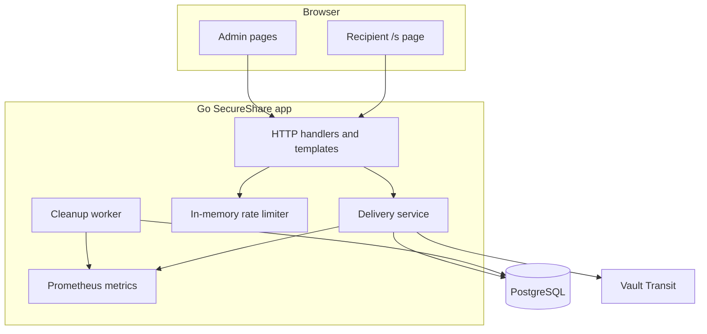
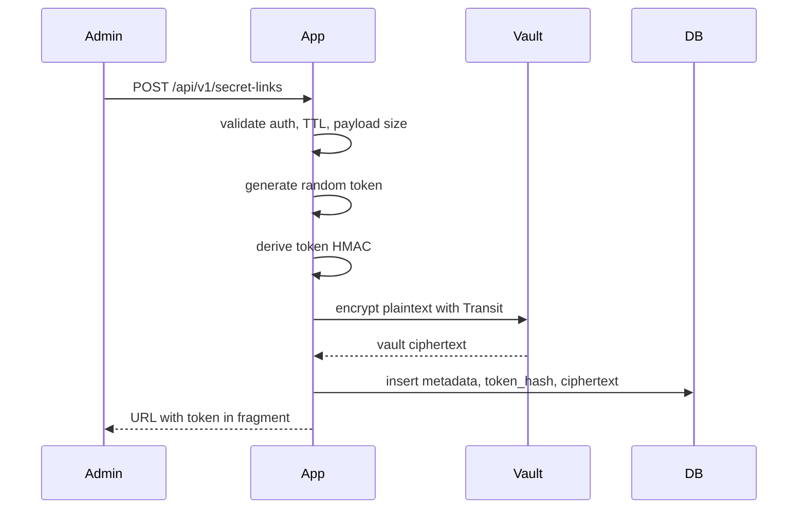
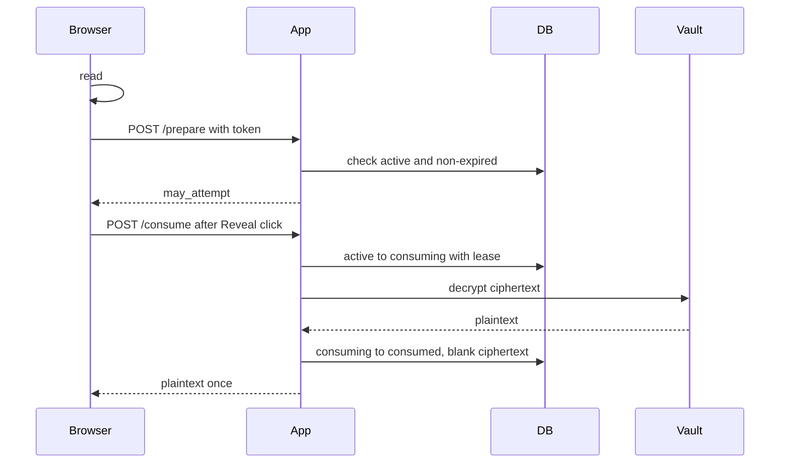
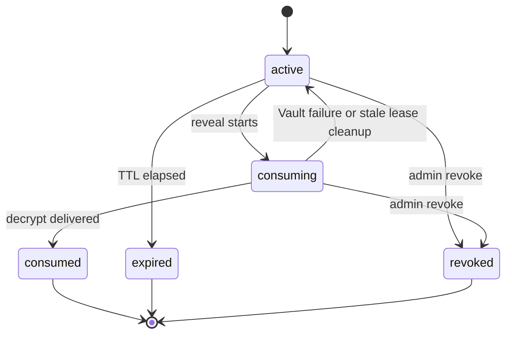

# Architecture

## Components

## Create Flow

The creation response never returns the plaintext secret.

## Reveal Flow

## Atomic State Machine

Only the holder of `consuming_lease_id` can restore or complete a consuming row.

## Database Model

The `secret_deliveries` table stores:

- UUID delivery ID
- Unique 32-byte token HMAC
- Vault ciphertext
- Safe metadata
- Status timestamps
- Optional Argon2id password hash
- Failed attempt counters

It does not store raw tokens or plaintext secrets.

## Failure Scenarios

- Vault encrypt failure during create: no database row is created.
- Vault decrypt failure during consume: leased row is restored to `active`; the recipient receives `503`.
- Duplicate consume: only one request can transition to `consuming`; others receive generic unavailable responses.
- Expired token: cleanup marks it `expired`; API still returns generic unavailable.
- Revoked token: payload is blanked and reveal returns generic unavailable.

## Cleanup Lifecycle

The cleanup worker:

- Marks active expired rows as `expired`.
- Restores stale consuming leases.
- Blanks consumed, expired, and revoked payloads after configured retention.
- Updates the active secret metric.

## Scaling Considerations

The MVP app is stateless except for in-memory sessions and rate limits. For multiple replicas, add:

- Shared session storage
- Redis-backed rate limiting
- A trusted reverse proxy that sets client IP headers
- Centralized logs and metrics
- A production Vault auth method

PostgreSQL remains the one-time guarantee authority.
