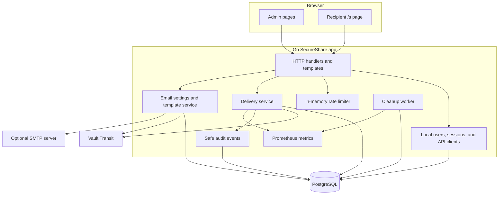
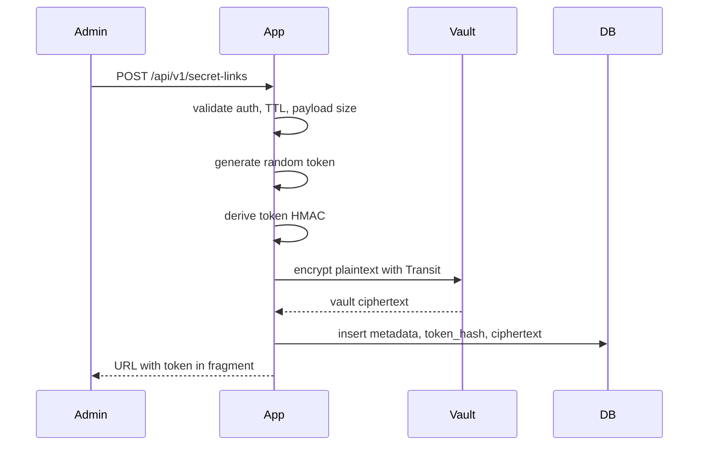
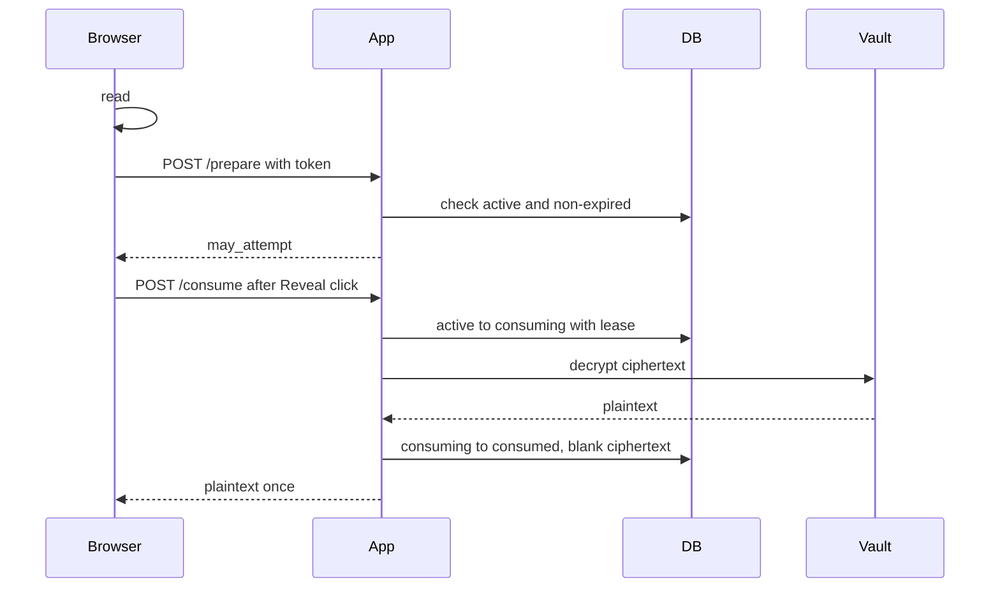
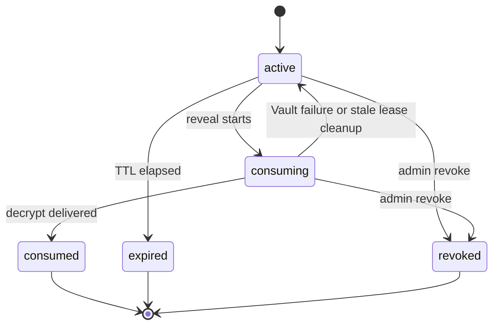

# Architecture

## Components

## Create Flow

The creation response never returns the plaintext secret.

When email is requested, the app first verifies `email:send`, SMTP settings, recipient address, and safe template rendering. Deterministic failures return `422` before a secret row is created. After the secret is created, the app builds `APP_BASE_URL + "/s#<raw-token>"`, renders a plain-text template into `text/plain` and escaped `text/html`, and sends synchronously. Runtime SMTP failure keeps the secret active and returns `201 Created` with a failed delivery result and the URL for manual handoff.

## Reveal Flow

## Atomic State Machine

Only the holder of `consuming_lease_id` can restore or complete a consuming row.

## Database Model

The `secret_deliveries` table stores:

- UUID delivery ID
- Unique 32-byte token HMAC
- Vault ciphertext
- Safe metadata
- Status timestamps
- Optional Argon2id password hash
- Failed attempt counters

It does not store raw tokens or plaintext secrets.

The `users`, `user_sessions`, and `api_clients` tables store local UI identities, only HMAC session-token hashes, and only HMAC API-client secret hashes. They do not store plaintext passwords, session tokens, or API client secrets.

The `email_settings` table stores one global SMTP configuration. SMTP password is stored only as Vault Transit ciphertext. It does not store raw tokens, full one-time URLs, rendered email bodies, SMTP response bodies, or secret payloads.

The `audit_events` table stores safe operational events only:

- Event type and result
- Optional delivery ID
- Actor ID
- Hashed IP
- Request ID
- Timestamp

It does not store payloads, raw tokens, full URLs, passwords, API keys, Authorization headers, Vault ciphertext, SMTP passwords, recipient emails, rendered email bodies, or user-agent strings.

## Failure Scenarios

- Vault encrypt failure during create: no database row is created.
- SMTP preflight failure during email create: no database row is created.
- SMTP runtime failure after create: the row remains `active`; the response includes the URL and a safe failed delivery category.
- Vault decrypt failure during consume: leased row is restored to `active`; the recipient receives `503`.
- Duplicate consume: only one request can transition to `consuming`; others receive generic unavailable responses.
- Expired token: cleanup marks it `expired`; API still returns generic unavailable.
- Revoked token: payload is blanked and reveal returns generic unavailable.

## Cleanup Lifecycle

The cleanup worker:

- Marks active expired rows as `expired`.
- Restores stale consuming leases.
- Blanks consumed, expired, and revoked payloads after configured retention.
- Deletes audit events after configured retention.
- Updates active secret, cleanup duration, cleanup deletion, and stale lease recovery metrics.

## Observability Model

Metrics intentionally avoid delivery IDs, recipient references, titles, usernames, token hashes, SMTP hosts, recipient addresses, or other high-cardinality labels. Fixed labels are used only for operation classes such as Vault operation, database operation, rate limit area, cleanup deletion kind, email template source, and safe SMTP error category.

## Scaling Considerations

The app keeps browser sessions in PostgreSQL. The remaining single-instance state is the in-memory rate limiter, including email send/test/retry limits. For multiple replicas, add:

- Redis-backed rate limiting
- A trusted reverse proxy that sets client IP headers
- Centralized logs and metrics
- A production Vault auth method

PostgreSQL remains the one-time guarantee authority.

## Production Boundaries

Local Docker Compose includes PostgreSQL and Vault dev mode for development. Production should use `docker-compose.production.yml` or equivalent platform manifests with external PostgreSQL and production Vault. The app expects HTTPS termination and sensitive log redaction at the reverse proxy; `deploy/nginx/secureshare.conf` is an example.
