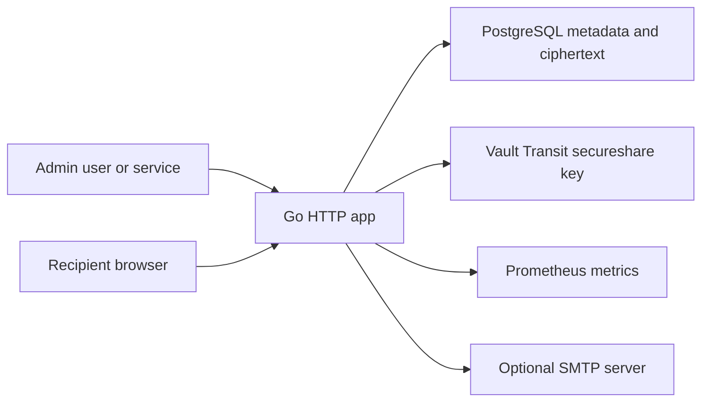

# SecureShare

SecureShare is a production-oriented MVP for secure one-time secret delivery. Internal developers or services create encrypted one-time links for credentials, API keys, access tokens, and similar sensitive values. Recipients open the link, explicitly click Reveal Secret, and can view the payload exactly once.

The local stack runs with Go, PostgreSQL, and HashiCorp Vault Transit through Docker Compose.

## Quick Start

```bash
cp .env.example .env
docker compose up -d --build
docker compose ps
make smoke
```

The app is available at:

```text
http://localhost:8080
```

Default local UI administrator:

```text
username: admin
password: change-me-now
```

Change the bootstrap password before any non-local use. The bootstrap user is created only when the `users` table is empty.

Default local legacy admin API key for machine requests:

```text
change-me
```

The legacy global key is deprecated for new integrations. Create scoped clients in `/admin/api-clients` and authenticate API calls with:

```bash
curl -u "$CLIENT_ID:$CLIENT_SECRET" ...
```

The Compose file also supplies development defaults, so `docker compose up -d --build` works before `.env` exists. Copy `.env.example` when you want to edit local settings.

## What It Does

- Creates one-time secret links with optional title, description, recipient reference, password protection, and expiration.
- Supports flexible encrypted payloads: structured fields, API keys, username/password combinations, text, JSON, and configuration snippets.
- Provides a responsive admin UI with dashboard, creation flow, secret metadata, secret listing, user management, API client management, system status, help, and light/dark mode.
- Provides safe admin APIs for dashboard statistics, paginated metadata listing, idempotent revoke, and manual cleanup.
- Supports scoped API clients with one-time client secret display, HMAC-hashed storage, expiration, disable, revoke, and rotation.
- Supports optional administrator-managed SMTP settings, encrypted SMTP password storage, safe email templates, and explicit one-time-link delivery by email.
- Serves local Swagger UI at `/docs` and raw OpenAPI 3.1 at `/openapi.yaml`.
- Uses at least 256 bits of random token entropy.
- Places the raw token in the URL fragment, for example `http://localhost:8080/s#token`, so browsers do not send it automatically in normal page requests.
- Stores only `HMAC-SHA256(token_pepper, raw_token)` in PostgreSQL.
- Encrypts secret payloads with Vault Transit before storage.
- Atomically transitions records through `active`, `consuming`, `consumed`, `expired`, and `revoked`.
- Records safe audit events for create, consume, revoke, expiration, password failure, and login outcomes.
- Returns a generic `410 Gone` for invalid, expired, revoked, consumed, locked, or unknown tokens.

## Architecture



The Go app renders the admin and recipient pages directly. There is no React, Node.js, external font, CDN, analytics script, or frontend build pipeline.

Email delivery is optional. Administrators configure SMTP at `/admin/settings/email`; the SMTP password is encrypted with Vault Transit and is never returned by API or HTML. Create-secret requests send email only when `delivery.email.send=true` or the compatibility alias `send_email=true` is explicitly provided. API clients also need the `email:send` scope.

## One-Time Consumption

Consume is concurrency-safe:

1. The backend derives the token HMAC.
2. PostgreSQL atomically transitions one matching active row to `consuming` with a short lease.
3. Password verification happens before Vault decrypt.
4. Vault decrypts the ciphertext.
5. PostgreSQL transitions the same leased row to `consumed` and blanks `encrypted_payload`.
6. The plaintext is returned once.

If Vault decrypt fails, the app restores the row to `active` while the same lease still owns it.

## Vault Encryption

Local Compose runs Vault dev mode and an idempotent `vault-bootstrap` container. The bootstrap enables the Transit engine and creates the `secureshare` key.

Production must use a persistent initialized and unsealed Vault cluster. Do not use dev mode in production.

## API Example

```bash
curl -sS -X POST http://localhost:8080/api/v1/secret-links \
  -u "$CLIENT_ID:$CLIENT_SECRET" \
  -H 'Content-Type: application/json' \
  --data '{
    "title": "Merchant production credentials",
    "recipient_reference": "merchant-1001",
    "secret": {"username":"merchant-1001","password":"temporary-password"},
    "expires_in_seconds": 86400,
    "password": null,
    "max_failed_attempts": 5
  }'
```

Open the returned `url` in a browser. The recipient page strips the fragment from the address bar before POSTing the token.

## Developer Documentation

- Swagger UI: `http://localhost:8080/docs`
- Raw OpenAPI: `http://localhost:8080/openapi.yaml`
- Developer guide: `docs/DEVELOPER_GUIDE.md`
- Examples: `examples/curl/`, `examples/go/`, `examples/python/`, `examples/javascript/`
- Postman collection: `docs/postman/`

Swagger UI and the OpenAPI spec are authenticated by default. Set `OPENAPI_PUBLIC=true` only when the deployment intentionally exposes the spec.

## UI Usage

1. Visit `http://localhost:8080/login`.
2. Enter the bootstrap username and password.
3. Optionally configure SMTP at `/admin/settings/email`.
4. Create a secret at `/admin/secrets/new`.
5. Choose Generate link only or Send link by email.
6. Copy the generated one-time URL when manual delivery is needed.
7. Optionally revoke the link before it is viewed.

The admin interface never shows the original secret after creation. Historical rows never reconstruct delivery URLs because raw tokens are not stored.

Email contains only the fragment-based one-time link, expiration context, and safe template text. It never includes the secret payload, link password, token hash, Vault ciphertext, SMTP credentials, or API client secrets. Link scanners and previews do not consume the secret; recipients must press Reveal to POST the token.

## Tests

```bash
make test
make lint
make openapi-validate
make smoke
make integration-test
make security-test
```

`make smoke`, `make integration-test`, and `make security-test` run against an isolated Compose project with `secureshare_test` PostgreSQL, test Vault, and Mailpit on local-only ports. The wrapper tears the test stack and volumes down after each run so automated tests do not pollute the development dashboard or audit timeline.

For optional development SMTP capture:

```bash
docker compose --profile mailpit up -d mailpit
```

Mailpit is development-only and is not present in the production Compose file.

The security test covers unauthorized create, invalid login, CSRF rejection, payload limits, invalid content types, first and second consume, concurrent consume, expired and revoked links, password throttling, security headers, cache prevention, and log leakage checks.

## Local Secret Rotation

For local development:

1. Stop the stack: `docker compose down`.
2. Generate new values for `SECURESHARE_ADMIN_API_KEY`, `TOKEN_HMAC_PEPPER`, `SESSION_SECRET`, `CSRF_SECRET`, `REQUEST_IP_HASH_PEPPER`, and bootstrap admin password if the database is empty.
3. Update `.env`.
4. Restart: `docker compose up -d --build`.

Changing `TOKEN_HMAC_PEPPER` invalidates existing unconsumed links because token lookup hashes no longer match.

## Troubleshooting

- `health/ready` fails: check `docker compose logs app vault vault-bootstrap postgres`.
- Vault bootstrap fails: verify `VAULT_TOKEN` matches the Vault dev root token.
- API client returns `401`: verify the client is active, unexpired, has the required scope, and is using Basic auth as `client_id:client_secret`.
- Email delivery returns `422`: configure and enable SMTP in `/admin/settings/email`, and ensure the API client has `email:send`.
- Email delivery returns `201` with `delivery.email.status="failed"`: the secret was created; copy the returned URL and inspect SMTP settings/logs with redaction.
- Create returns `503`: Vault is not ready or the Transit key is missing.
- Consume returns `410`: the token is invalid, expired, revoked, locked, or already viewed. The response is intentionally generic.
- Login fails locally: use the bootstrap user, default `admin` / `change-me-now`, or reset the local database volume.

## Production Deployment

Production guidance is in:

- `docs/DEPLOYMENT.md`
- `docs/PRODUCTION_CHECKLIST.md`
- `docs/THREAT_MODEL.md`
- `docker-compose.production.yml`
- `deploy/nginx/secureshare.conf`
- `deploy/vault/secureshare-policy.hcl`

Use HTTPS only, HSTS, a real Vault cluster, short-lived Vault credentials, PostgreSQL TLS, strong environment secrets, Redis-backed rate limiting for multiple replicas, body redaction in APM/reverse proxies, log shipping, backups, container scanning, and restricted network access.

Known MVP limitations:

- Rate limits are in memory and are single-instance.
- Local Vault runs in dev mode.
- UI authentication uses local PostgreSQL users and sessions; machine authentication supports scoped API clients and the deprecated global admin API key.
- OIDC, LDAP, MFA, Redis-backed limits, SMS OTP, asynchronous queue delivery, and multi-tenant isolation are not implemented yet.
- Historical email resend is unavailable after refresh because raw tokens are not persisted.
