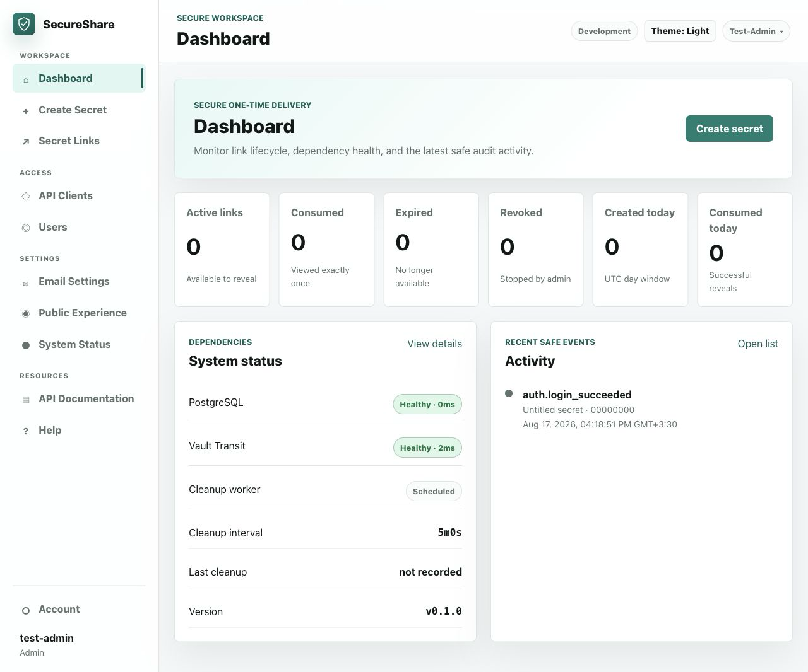
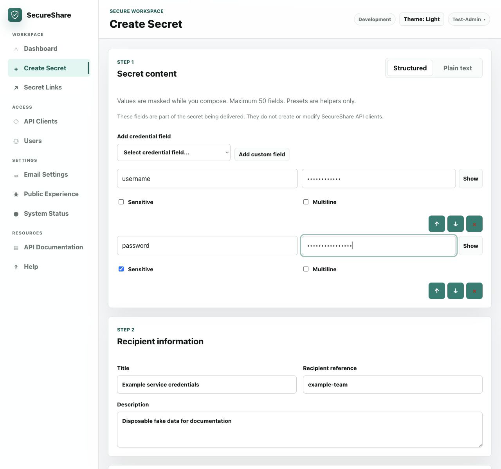
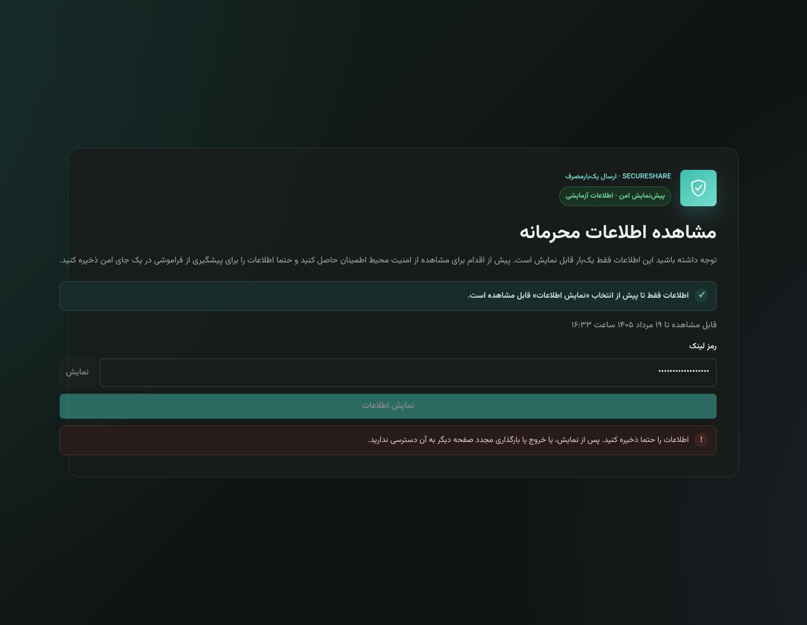
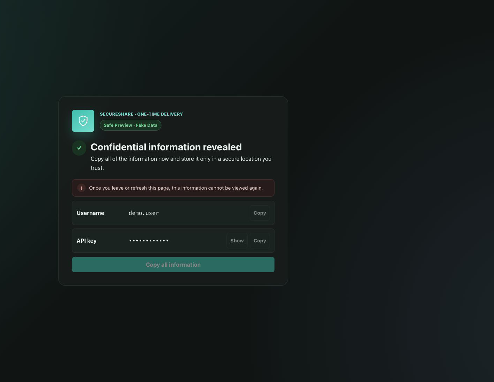
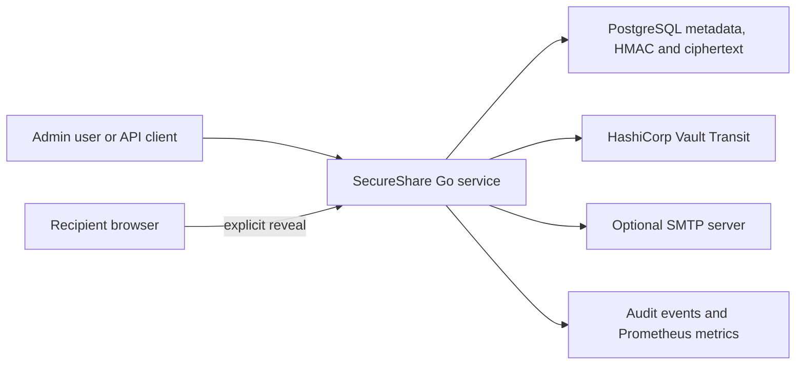

# SecureShare

SecureShare is a self-hosted one-time secret delivery service for securely sharing passwords, API keys, credentials, and other sensitive information without leaving permanent plaintext copies behind.

It combines a server-rendered Go application, PostgreSQL metadata, and HashiCorp Vault Transit encryption with explicit one-time reveal, optional link passwords, scoped API clients, and English/Persian recipient pages.

## Screenshots

| Admin dashboard | Create a secret |
| --- | --- |
|  |  |

| Persian recipient | Revealed information |
| --- | --- |
|  |  |

All screenshots use isolated fake fixtures. They contain no usable credentials or one-time links.

## Why SecureShare?

Chat, tickets, email, and shared documents often retain credentials long after a handoff is complete. SecureShare provides a bounded delivery flow instead:

1. An administrator, developer, or API client creates an encrypted delivery.
2. The recipient receives a fragment-based link and optionally a password through a separate channel.
3. Opening the page does not consume the information.
4. The recipient explicitly chooses **Reveal information**.
5. A successful reveal atomically consumes the delivery and removes its ciphertext from active storage.

## Features

- One-time links with explicit reveal and atomic consumption
- Vault Transit encryption; plaintext payloads are not stored in PostgreSQL
- Fragment-only raw tokens with HMAC lookup; raw tokens are not stored
- Optional Argon2id link passwords and failed-attempt limits
- Structured credentials, text, JSON, and configuration payloads
- Scoped API clients with one-time-visible client secrets
- Optional SMTP delivery with safe customizable templates
- OpenAPI 3.1 and locally served Swagger UI
- English and Persian recipient experiences, including Jalali dates in Persian
- Bundled Vazirmatn font with RTL layout and LTR-isolated technical values
- PostgreSQL-backed users, roles, sessions, and theme preferences
- Audit events, Prometheus metrics, readiness checks, and public version metadata
- Responsive server-rendered UI with light and dark themes
- Docker Compose development and documented production deployment

## Security Model

SecureShare is designed to minimize retained secret material:

- The backend sends plaintext to Vault Transit for encryption and briefly handles plaintext during reveal. SecureShare is therefore **not** zero-knowledge or end-to-end encrypted.
- PostgreSQL stores metadata, an HMAC token lookup value, and Vault ciphertext—not plaintext payloads or raw tokens.
- The raw token is placed after `#` in the recipient URL. Browsers do not send URL fragments in ordinary HTTP requests.
- Recipient JavaScript removes the fragment immediately and keeps the token only in page memory.
- A `GET` request never consumes a delivery. Reveal requires an explicit `POST`.
- PostgreSQL atomically moves one matching active delivery through a short consuming lease. Concurrent reveal attempts cannot both succeed.
- A successful consume blanks the stored ciphertext before returning plaintext once.
- Recipient pages and sensitive API responses use `no-store`, strict CSP, no external scripts, and no analytics.
- Application logs exclude request/response bodies, Authorization headers, raw links, tokens, passwords, ciphertext, and secret payloads.

Read [SECURITY.md](SECURITY.md) and the [threat model](docs/THREAT_MODEL.md) before operating SecureShare in production.

## Quick Start

Requirements: Docker with Compose v2 and Git.

```bash
git clone https://github.com/Operalith/secureshare.git
cd secureshare
cp .env.example .env
docker compose up -d --build
docker compose ps
curl -fsS http://localhost:8080/health/ready
```

Open [http://localhost:8080](http://localhost:8080).

Development-only bootstrap login:

```text
username: admin
password: change-me-now
```

These defaults are intentionally rejected by production validation. Change them before any non-local deployment. The bootstrap administrator is created only when the users table is empty.

Local Compose also includes a deprecated development-only global API key (`change-me`). New integrations should create a scoped API client under `/admin/api-clients`.

## How It Works


```mermaid
flowchart LR
  A["Admin user or API client"] --> B["SecureShare Go service"]
  B --> C["PostgreSQL metadata, HMAC and ciphertext"]
  B --> D["HashiCorp Vault Transit"]
  B --> E["Optional SMTP server"]
  F["Recipient browser"] -->|"explicit reveal"| B
  B --> G["Audit events and Prometheus metrics"]
```

The Go service renders both the authenticated administration UI and public recipient pages. There is no JavaScript framework, CDN, external font service, or frontend build pipeline.

## Creating a Secret

From the UI:

1. Sign in and open **Create secret**.
2. Choose structured fields, text, or JSON.
3. Set expiration and optional link-password protection.
4. Choose **Generate link only** or **Send link by email**.
5. Deliver the link through an approved channel. Deliver a link password separately.

The administration UI never reconstructs a delivery URL later because raw tokens are not persisted.

With a scoped API client:

```bash
curl -sS -X POST http://localhost:8080/api/v1/secret-links \
  -u "$CLIENT_ID:$CLIENT_SECRET" \
  -H 'Content-Type: application/json' \
  --data '{
    "title": "Example service credentials",
    "recipient_reference": "example-user",
    "payload": {
      "type": "structured",
      "fields": [
        {"label":"Username","value":"example-user","sensitive":false},
        {"label":"Password","value":"example-password","sensitive":true}
      ]
    },
    "expires_in_seconds": 86400,
    "max_failed_attempts": 5
  }'
```

## API and Swagger

- Swagger UI: `/docs`
- OpenAPI document: `/openapi.yaml`
- Version metadata: `/version`
- Liveness: `/health/live`
- Readiness: `/health/ready`

Swagger and OpenAPI are authenticated by default. Set `OPENAPI_PUBLIC=true` only when the deployment intentionally exposes API documentation.

```bash
curl -fsS http://localhost:8080/version
```

```json
{"version":"0.1.0","commit":"unknown","build_date":"unknown"}
```

Docker builds may inject `SECURESHARE_BUILD_COMMIT` and `SECURESHARE_BUILD_DATE` without changing the authoritative application version.

See [API.md](API.md), the [developer guide](docs/DEVELOPER_GUIDE.md), and examples for [cURL](examples/curl/), [Go](examples/go/), [Python](examples/python/), and [JavaScript](examples/javascript/).

## Email Delivery

SMTP is optional and configured by administrators at `/admin/settings/email`. The SMTP password is encrypted with Vault Transit and is never returned by the API or HTML.

Email delivery is explicit per secret. API clients require the `email:send` scope. Delivered messages contain only the one-time link, expiration context, and safe template content—never the secret payload or link password.

For local capture:

```bash
docker compose --profile mailpit up -d mailpit
```

Mailpit is available at [http://localhost:8025](http://localhost:8025). It is development-only and is not included in the production Compose file.

## English and Persian Recipient UI

Administrators choose the global public language at `/admin/settings/public-experience`.

- English pages are LTR and display Gregorian dates in the browser's local timezone.
- Persian pages are RTL, use the bundled Vazirmatn font, and display Jalali dates in the browser's local timezone.
- Usernames, passwords, URLs, API keys, and code remain LTR-isolated in Persian pages.
- Ready, revealed, retry, unavailable, session-lost, and network-error states remain fully localized.

The original UTC timestamp remains unchanged in storage, APIs, and `<time datetime>` attributes.

## Configuration

Copy [.env.example](.env.example) for local development. Important settings include:

| Variable | Purpose |
| --- | --- |
| `APP_BASE_URL` | Public application origin |
| `DATABASE_URL` | PostgreSQL connection string |
| `VAULT_ADDR` / `VAULT_TOKEN` | Vault Transit access |
| `TOKEN_HMAC_PEPPER` | Raw-token lookup HMAC key |
| `SESSION_SECRET` / `CSRF_SECRET` | Browser session and CSRF protection |
| `BOOTSTRAP_ADMIN_*` | First administrator created only in an empty database |
| `COOKIE_SECURE` | Must be `true` outside development |
| `MAX_SECRET_TTL` | Maximum allowed delivery lifetime |
| `METRICS_ENABLED` | Enables `/metrics` |
| `OPENAPI_PUBLIC` | Makes API documentation public when intentionally enabled |

Never commit a populated `.env` file or production credentials.

## Production Deployment

Use [docker-compose.production.yml](docker-compose.production.yml) with:

- HTTPS termination and HSTS
- A persistent initialized and unsealed Vault cluster—not Vault dev mode
- Short-lived Vault authentication and Vault audit devices
- PostgreSQL TLS, encrypted backups, and least-privilege credentials
- Strong externally managed application secrets
- Request/response body capture disabled in proxies, WAFs, APM, and tracing
- Restricted network paths between SecureShare, PostgreSQL, Vault, and SMTP
- Shared session/rate-limit infrastructure before running multiple instances

Start with the [deployment guide](docs/DEPLOYMENT.md), [production checklist](docs/PRODUCTION_CHECKLIST.md), [operations guide](OPERATIONS.md), and [architecture](ARCHITECTURE.md).

## Observability

SecureShare provides:

- Structured JSON application logs with sensitive-data exclusions
- Safe audit events with actor, result, request ID, delivery ID, and hashed IP metadata
- `/health/live` and `/health/ready`
- Optional Prometheus metrics at `/metrics`
- Application version and build metadata at `/version` and in System Status

## Development

```bash
go test ./...
go vet ./...
make openapi-validate
```

Run the full stack with `docker compose up -d --build`. Source is formatted with `gofmt`; commits follow Conventional Commits.

## Testing

```bash
make test
make lint
make ui-time-test
make openapi-validate
make smoke
make integration-test
make security-test
make qa-test
make ui-e2e
make recipient-qa-test
```

Docker-backed test targets use isolated PostgreSQL, Vault, and Mailpit fixtures and remove their volumes afterward. Browser tests cover permissions, navigation, credential creation, link protection, theme persistence, localized recipient states, RTL/LTR isolation, and responsive layouts.

## Documentation

- [Architecture](ARCHITECTURE.md)
- [API reference](API.md)
- [Operations guide](OPERATIONS.md)
- [Security policy](SECURITY.md)
- [Deployment guide](docs/DEPLOYMENT.md)
- [Developer guide](docs/DEVELOPER_GUIDE.md)
- [Threat model](docs/THREAT_MODEL.md)
- [Production checklist](docs/PRODUCTION_CHECKLIST.md)
- [UI architecture](docs/UI_ARCHITECTURE.md)
- [UI QA checklist](docs/UI_QA_CHECKLIST.md)
- [Changelog](CHANGELOG.md)

## Known Limitations in v0.1.0

- Local Docker Compose uses Vault dev mode.
- SMTP delivery is synchronous.
- Rate limiting is in-memory and is not coordinated between multiple instances.
- Production multi-instance deployments require shared rate limiting and session storage.
- Historical email resend is unavailable because raw link tokens are not stored.
- SSO, LDAP, MFA, SMS OTP, asynchronous delivery queues, and multi-tenant isolation are not part of v0.1.0.

## Security

Do not report vulnerabilities in a public issue. Use [GitHub Private Vulnerability Reporting](https://github.com/Operalith/secureshare/security/advisories/new) as described in [SECURITY.md](SECURITY.md).

Never include passwords, API keys, raw SecureShare links, SMTP credentials, Vault tokens, or secret payloads in issues, pull requests, screenshots, or logs.

## Contributing

Contributions are welcome. Read [CONTRIBUTING.md](CONTRIBUTING.md) before opening a pull request.

## License

SecureShare is available under the [MIT License](LICENSE).
